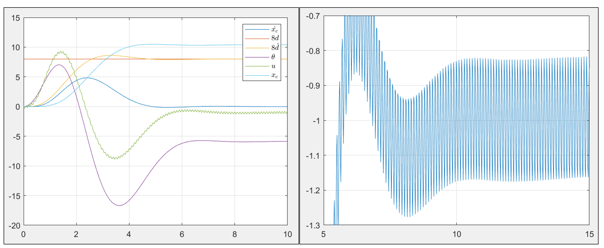

# Control Optimization of the System with Disturbance and Sensor Noise using LQR and Kalman Filter

### Given the input force _u_ applied to the cart, the disturbance _d_ acting on the pendulum tip, and sensor noise _v_, design an optimal controller that estimates the state and minimizes the cost so that the closed-loop system converges and the inverted pendulum tip is stabilized.

<p align="center">
  
</p>

The physical system is modeled with three state variables: pendulum angle, angular velocity, cart velocity. The system is linearlized assuming small pendulum angle.
M = 2kg, m = 1kg, l = 4m, g = 9.8m/s^2


## Step 1. Design Feedback Controller (LQR)
Let's say that we have a sensor for the cart velocity and we want to have our system optimally converge to the static equilibrium. The cost function is defined to be:


Define the perturbation variables as:


Then, the Q and R matrices can be calculated:


Three necessary and sufficient conditions for the existence of an optimal control are checked, and then lqr function is used to obtain the controller gain.

1. (A,B) stabilizable -> PBH Rank Test: rank(ctrb(A,B)) = 3
2. Q and R non-singular positive matrix
3. (Q,A) has no unobservable mode on imaginary axis: rank(obsv(C,A)) = 3

```Matlab
[Ko,~,~] = lqr(A,B,Q,R);
Ko = -Ko;
```


## Step 2. Design State Estimator (Kalman Filter)

Define the augmented system and introduce disturbance _d_ and sensor noise _v_


Generalized plant for H2 optimal Control:


Applying the Duality Property of LQR and Kalman Filter, we can obtain the Kalman Gain F:

0&space;}">

```Matlab
[F,~,~] = lqr(Ak',Ck',W,V);
F = -F';
```

## Step 3. Simulation (Basic Model)

With the controller gain _K_ and the Kalman gain _F_, we can now define the closed loop system and simulate the basic model (sensor noise ignored)


Since there is no input to the basic model (no sensor noise), we can use init function in Matlab to simulate the system:

```Matlab
model_basic = ss(Acl,[],[],[]);
[~,t,x] = init(model_basic,x0,20);
```

<p align="center">
  
</p>

## Step 4. Simulation (Additional Tuning Parameter)
Introduce tuning parameter so that our system can be robust with the presence of the sensor noise:


With new parameters, controller gain and Kalman gain need to be re-obtained

```Matlab
[Ko,~,~] = lqr(A,B,Q,alpha^2);
Ko = -Ko;
[F,~,~] = lqr(Ak',Ck',W,beta^2);
F = -F';
```
Tuning Method: 

-Increasing alpha will slower the state convergence and decreasing alpha will fasten the state convergence.

-Increasing beta will reduce the noise sensitivity. Tune alpha to meet the convergence requirements and tune beta to meet the noise sensitivity requirements.

System is also defined so that it contains the tuning parameters:


Assuming that the sensor noise has a sinusoidal property:


```Matlab
model_robust = ss(Acl,Bcl,Ccl,Dcl);
t = linspace(0,20,1000);
u1 = ones(1,length(t));
u2 = 0.01*sin(20*pi*t)/beta;
[y,t,x] = lsim(model_robust,[u1' u2'],t,x0);
```
<p align="center">
  
</p>

Due to the sensor noise, there is a fluctuation in controller input; however, the fluctuation is minimized with the tuning parameters. The figure on the right shows the zoom-ed in graph of input _u_, and we can see that the amplitude after 14 seconds (max-min) are less than 0.4. The following design specifications are satisfied:

(i) The cart-pendulum converges to static equilibrium.

(ii) The cart-pendulum comes to a stop with the minimum displacement. (LQR)

(iii) The system is robust against the sensor noise. (Input amplitude after 14sec is less than 0.04)


